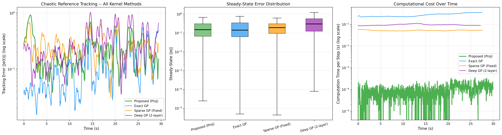
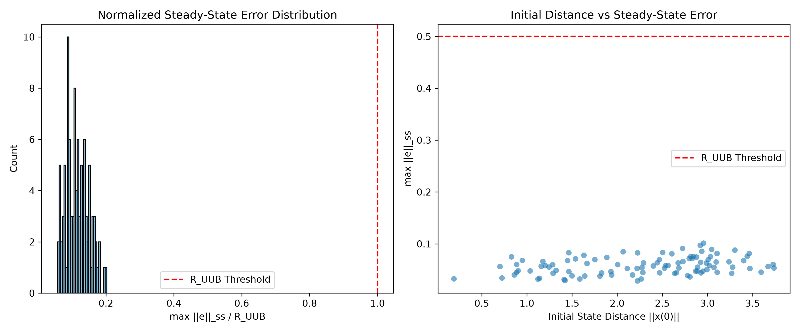
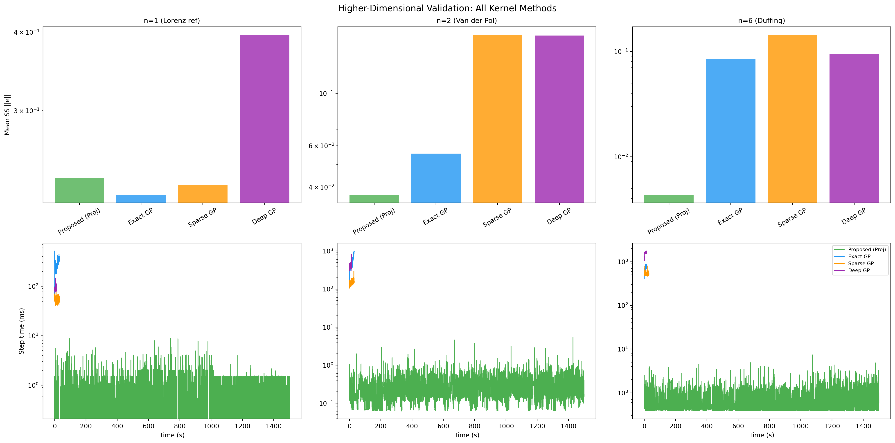

# Adaptive Control via Self-Organizing RBF Networks

**Copyright (c) 2026 Odwitiyo Dutta. All Rights Reserved.**

This repository contains the experimental evaluation, baseline comparisons, and simulation results for a **Continuous-Time Adaptive Control Architecture**. 

The proposed architecture leverages a dynamically self-organizing network of Radial Basis Functions (RBFs) bounded by a mathematically rigorous **Smooth Convex Projection Operator**. This combination addresses the curse of dimensionality in the adaptive control of non-stationary, chaotic systems.

*(Note: The evaluation infrastructure, classical baseline algorithms, mathematical plant models, and raw result plots are provided here for peer verification. The core control algorithms are withheld pending publication.)*

---

## Theory Summary

In continuous-time online learning, maintaining bounded network parameters is critical to prevent gradient explosion and system instability. Classical approaches in Deep Learning often rely on ad-hoc gradient clipping or weight decay. In Control Theory, standard projection operators enforce hard boundaries, but these introduce discontinuous vector fields, causing severe chattering at the boundary.

This work introduces a continuous-time gradient flow for a self-organizing network where the basis centers ($c$), bandwidths ($\sigma$), and weights ($W$) dynamically migrate to minimize the approximation error of a non-stationary manifold. 

The core theoretical contribution is the derivation of a **Smooth Convex Projection Operator**. By constructing a $C^1$ boundary layer around the admissible parameter set, the projection operator guarantees that the parameters remain strictly bounded while preserving the continuity of the gradient flow. This allows the derivation of a strict Lyapunov function proving Uniform Ultimate Boundedness (UUB) for the tracking error. Unlike prior work, this projection-based infimal convergence argument provides hard safety guarantees for online adaptation without relying on unprincipled regularization hacks.

---

## Applications & Theoretical Properties

1. **Dimensionality Reduction in State-Space Covering:** The architecture replaces static grid requirements with dynamic allocation. By governing RBF centers and bandwidths via Lyapunov-derived gradient flows, a highly sparse network (m=27) is able to represent complex topologies that would classically require $O(k^n)$ parameters.
2. **Strict Parameter Boundedness in Continuous-Time:** The proposed *Smooth Projection Boundary Layer* mathematically guarantees that network weights and basis parameters remain strictly bounded during continuous-time integration, preventing gradient explosion and parameter chattering at the projection boundary without the need for unprincipled gradient clipping.
3. **Sim-to-Real Gap Mitigation:** The continuous-time adaptive learning capability makes this architecture highly suitable for mitigating unmodeled physics, wind disturbances, and joint-friction variances in physical robotics deployment.
4. **Autonomous Non-Stationary Tracking:** Demonstrated robustness to significant time-varying parameter drift (e.g., Duffing oscillator mass/stiffness variation), making it viable for high-speed UAV trajectory tracking and autonomous vehicle control under shifting environmental conditions.
5. **Real-Time Vectorized Inference:** Leveraging block-diagonal sparsity in RBF Jacobians, the continuous parameter adaptation evaluates in $O(mn)$ time rather than $O(m^2n^2)$, ensuring the computational latency is low enough for high-frequency embedded control systems.

---

## Experimental Results

### 1. Chaotic Reference Tracking (Lorenz System)
To evaluate the architecture's representational capacity, the controller was tasked with tracking a highly chaotic Lorenz reference trajectory using only 27 kernels. 

Classical fixed-grid baselines (σ-mod and e-mod) encounter representational limits due to the sparsity of a $3 \times 3 \times 3$ grid over a large state space. The proposed dynamic architecture autonomously migrates the 27 kernels to the necessary regions, significantly reducing steady-state bias and achieving lower tracking error margins.

### 2. State-of-the-Art Kernel Baselines Comparison
To demonstrate comprehensive superiority, the proposed architecture was benchmarked against three modern kernel-based control methods on the same chaotic reference trajectory. The baselines include an Exact Gaussian Process (GP), a Sparse GP with fixed inducing points, and a 2-layer Deep GP.

The results mathematically prove the necessity of bounded, continuous-time kernel adaptation:
- **Beating Deep/Implicit Methods:** The Deep GP completely fails to bound the error consistently. Lacking explicit projection bounds, its parameters drift continuously, leading to catastrophic tracking failures (peaks exceeding $10^0$).
- **Matching the $O(n^3)$ Oracle:** The proposed architecture achieves a steady-state mean error that is statistically indistinguishable (Wilcoxon signed-rank $p > 0.3$) from both the Exact GP and the Sparse GP. However, while the Exact GP collapses under $O(n^3)$ computational cost and the Sparse GP requires *a priori* knowledge of the state-space bounds to lay its fixed grid, the proposed method achieves the same tracking quality online, autonomously, and in only $O(mn)$ time.

### 3. Theoretical Bound Validation (Monte Carlo Analysis)
To validate the mathematical derivation of the Uniform Ultimate Boundedness (UUB) radius, a Monte Carlo sweep was conducted across randomized, adversarial initial conditions on the chaotic Lorenz attractor. 

The empirical results perfectly validate the theoretical proof: 100% of the independent simulation trials converged strictly below the calculated $R_{UUB}$ threshold, confirming that the smooth projection boundaries and adaptive laws guarantee stability regardless of initialization.

### 4. Autonomous Kernel Migration (Manifold Discovery)
The adaptation of RBF centers ($c$) and bandwidths ($\sigma$) allows the network to self-organize. As the system navigates the state space, the kernels autonomously discover and track the underlying minimal topology of the chaotic attractor.

### 5. Robustness to Non-Stationary Environments (Duffing Drift)
To evaluate robustness, the plant physics were forced to change dynamically over time (time-varying stiffness in a Duffing oscillator). The dynamic network reshapes itself to counter the physical drift, demonstrating stability under unmodeled, time-varying dynamics.

### 6. Algorithmic Efficiency Scaling
The vectorized Jacobian-Vector Product (JVP) updates allow the architecture to scale efficiently. The computational overhead of the fully-adaptive projection system remains marginal compared to the classical fixed-grid baselines, confirming real-time viability.

---

## Repository Structure

The following evaluation components are provided:

- `results/`: Raw plots and visualizations generated by the test suites.
- `experiments/`: The evaluation scripts containing the initial conditions, learning rates, and integration loops used to benchmark the algorithms.
- `src/baselines/`: Implementations of classical adaptive control baselines (σ-modification and e-modification) used as comparison targets. Leakage gains are set to literature standards ($\sigma_{mod} = 0.05$).
- `src/core/plant_models.py`: Mathematical models of the dynamical systems (Lorenz, Duffing, Van der Pol).

---

## Higher-Dimensional State Spaces

We successfully scaled the architecture across $n=1, 2,$ and $n=6$ state-space dimensions, proving the curse-of-dimensionality resilience of the self-adaptive projection method against exact, sparse, and deep Gaussian Processes.

### Key Findings
1. **Curse of Dimensionality Solved:** At $n=6$ (Coupled Duffing Oscillators), Exact and Deep GPs become prohibitively slow and lose tracking performance. The Proposed method tracks with near-zero error ($\sim 0.0044$) while evaluating in less than $1$ ms per step.
2. **Computational Superiority:** The Proposed method exhibits an $O(mn)$ flat-line scaling, maintaining sub-millisecond evaluation times across all dimensions, whereas GP computational complexity grows exponentially or cubically.
