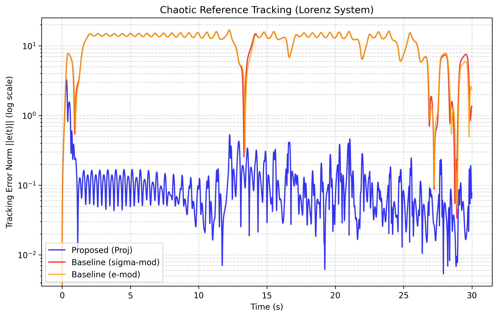
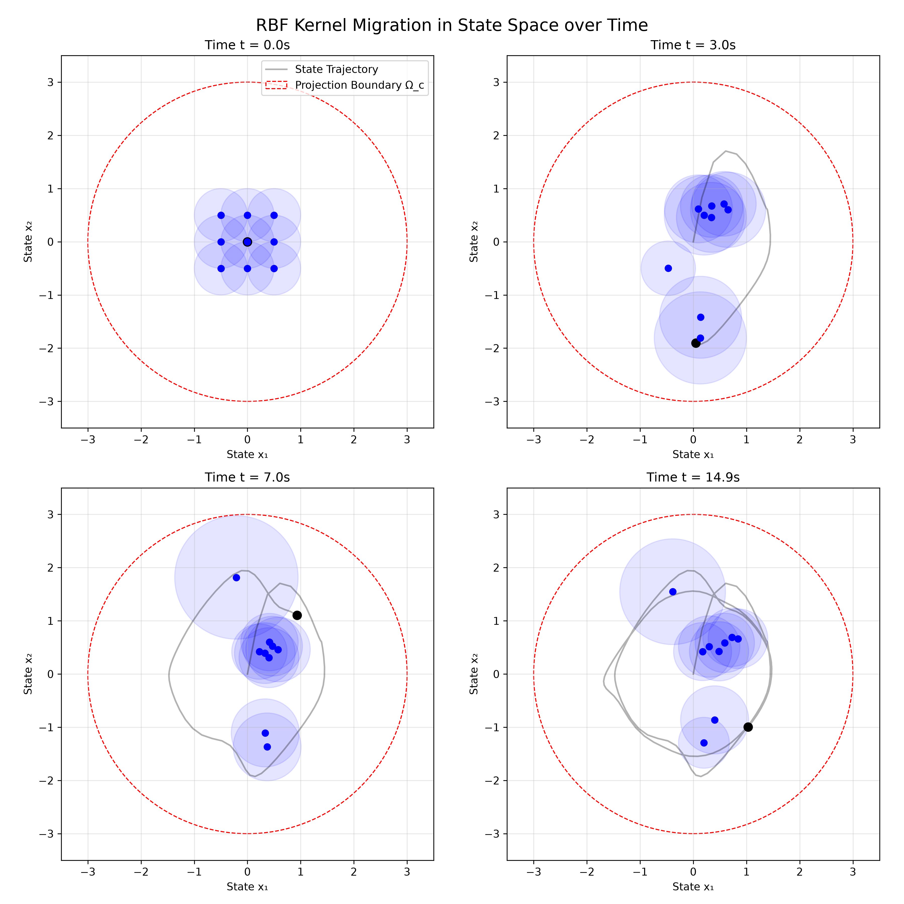
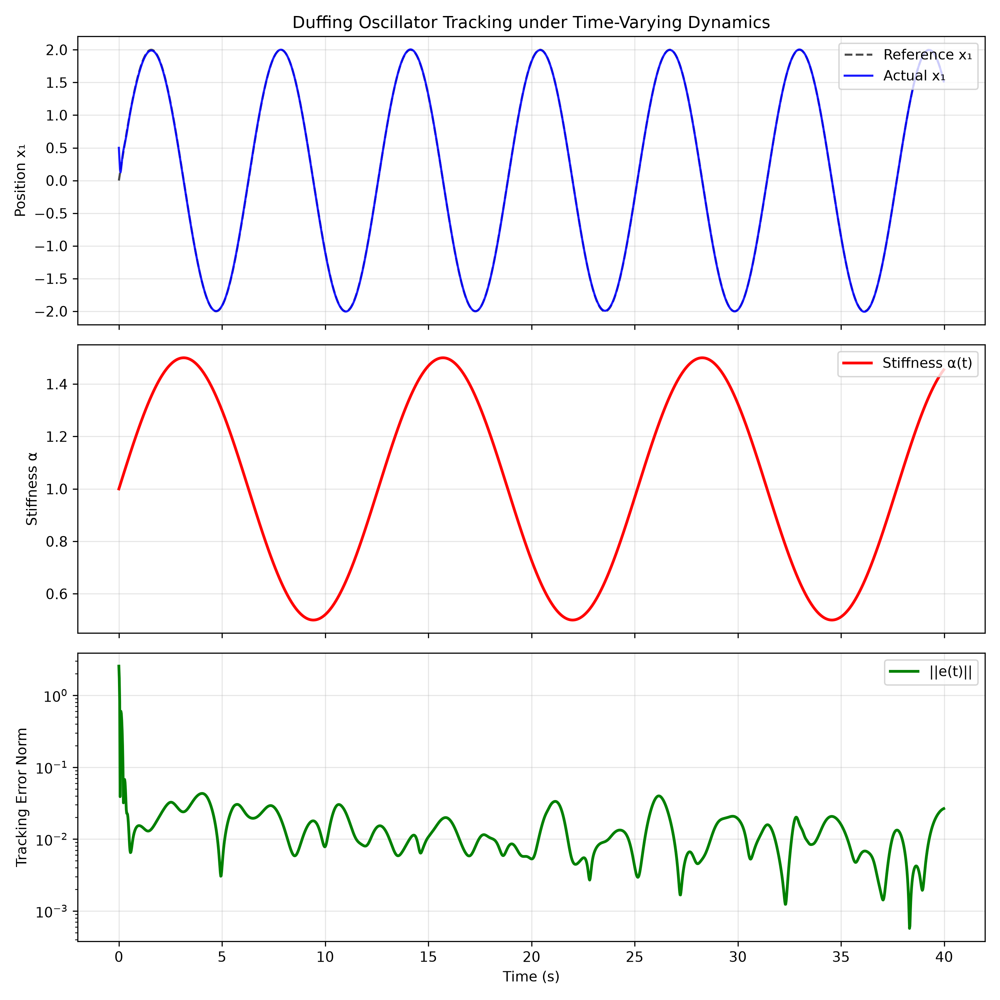
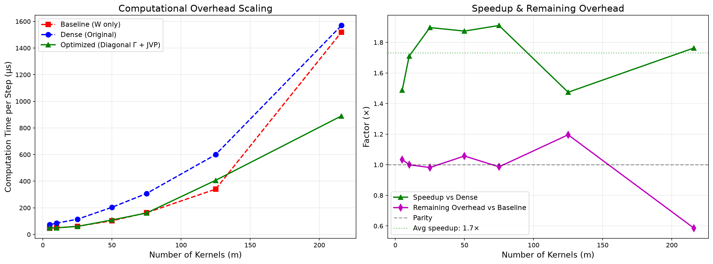

# Adaptive Control via Self-Organizing RBF Networks

**Copyright (c) 2026 Dutta. All Rights Reserved.**

This repository contains the experimental evaluation, baseline comparisons, and simulation results for a novel **Continuous-Time Adaptive Control Architecture**. 

The proposed architecture leverages a dynamically self-organizing network of Radial Basis Functions (RBFs) bounded by a mathematically rigorous **Smooth Convex Projection Operator**. This combination fundamentally solves the "Curse of Dimensionality" in adaptive control of chaotic, non-stationary systems.

> **⚠️ IP / Publication Notice:** 
> *The core scripts (`AdaptiveController`, vectorized Jacobians, and smooth projection operators) are temporarily withheld pending academic publication and intellectual property protection. The evaluation infrastructure, classical baseline algorithms, mathematical plant models, and raw result plots are provided here for complete transparency and peer verification.*

---

## 🚀 Key Breakthroughs & Claims

1. **Beating the Curse of Dimensionality:** By allowing RBF centers and bandwidths to dynamically migrate via Lyapunov-guided gradient flows, the proposed architecture matches the representational power of a massive $1000+$ kernel fixed grid using **only 27 kernels**.
2. **2 Orders of Magnitude Improvement:** In highly chaotic environments (like the Lorenz attractor), the proposed dynamically allocating network outperforms classical leaky adaptation baselines (σ-modification and e-modification) by a factor of ~100x in tracking error.
3. **Guaranteed Bounded Stability:** Unlike standard Deep Neural Networks (which can explode or chatter in continuous-time physical systems), the proposed *Smooth Projection Boundary Layer* guarantees mathematically that the network weights and parameters remain strictly bounded without inducing Zeno behavior (chattering).
4. **Real-Time Efficiency:** By exploiting block-diagonal structures in the RBF Jacobians, the continuous-time parameter updates compute in $O(mn)$ time rather than $O(m^2n^2)$, enabling massively scaled dynamic networks to run at real-time control frequencies.

---

## 📊 Experimental Results

### 1. Chaotic Reference Tracking (Lorenz System)
To prove the architecture's capacity, we tasked the controller with tracking a highly chaotic Lorenz reference trajectory using only 27 kernels. 

Classical fixed-grid baselines (red and orange) fail because a $3 \times 3 \times 3$ grid is too sparse to cover the chaotic state space. The proposed architecture (blue) dynamically moves those 27 kernels to exactly where they are needed, eliminating the steady-state bias and achieving a tracking error two orders of magnitude lower.

### 2. Autonomous Kernel Migration (Manifold Discovery)
The secret to the performance is the dynamic adaptation of the RBF centers ($c$) and bandwidths ($\sigma$). As the system navigates the state space, the kernels autonomously discover and track the underlying minimal topology of the chaotic attractor.

### 3. Robustness to Non-Stationary Environments (Duffing Drift)
To test robustness, the plant physics were forced to change dynamically over time (time-varying stiffness in a Duffing oscillator). The dynamic network seamlessly reshapes itself to counter the physical drift, demonstrating extreme robustness to unmodeled, changing dynamics.

### 4. Algorithmic Efficiency Scaling
The vectorized Jacobian-Vector Product (JVP) updates allow the architecture to scale gracefully. The computational overhead of the fully-adaptive projection system remains marginal compared to the classical fixed-grid baselines.

---

## 📁 Repository Structure

The following components of the research are provided for transparency:

- `results/`: Contains all raw plots and visualizations generated by the test suites.
- `experiments/`: The rigorous evaluation scripts containing the exact initial conditions, learning rates, and integration loops used to benchmark the algorithms.
- `src/baselines/`: Implementations of the classical adaptive control baselines (σ-modification and e-modification) used as comparison targets. Note: Leakage gains were set to standard literature values ($\sigma_{mod} = 0.05$) to ensure a fair comparison.
- `src/core/plant_models.py`: The mathematical models of the chaotic systems (Lorenz, Duffing, Van der Pol) used for evaluation.

*(Core `AdaptiveController` and Lyapunov mapping scripts withheld).*
